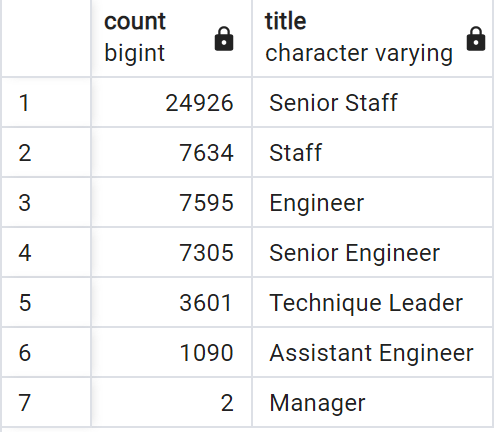
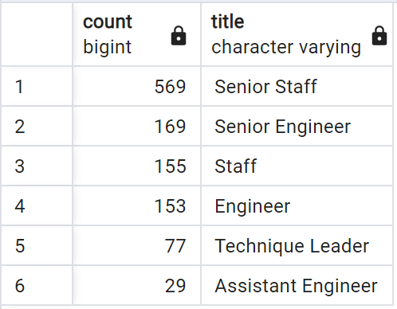

#  Pewlett Hackard Analysis

## Overview
This analysis uses a number of employee information data tables stored originally as CSV files. The files are imported into a PostgreSQL database for the purpose of preparing an analysis to be ready for a wave of upcoming retirements. Retiree candidates are identified and their information is extracted and exported into multiple CSVs to aid with the company's upcoming retirement wave.

### Data
All data is in the `Data` folder. The database schema can be found in the `schema.sql` file. The queries that generate the analysis can be found in the `Employee_Database_challenge.sql` file with accompanying commentary on their purpose.

## Results
The following table shows the retirees by job title.

- 2 Managers are eligible to retire and a plan must be developed to either train within or setup an outside hiring process
- A vast number of Senior Staff are eligible for retirement. The current breadth of regular staff under reitement age should be able to cover the vacancies, but a training regiment must be implemented, preferably involving the expertise of the retiring Senior Staff.

The following table shows the eligible (born in 1965) mentors by title.

- Over 500 Senior Staff are mentor-eligible, which eases a huge burden on the training process for the new Senior Staff that will need to be promoted.
- There are no mentor-eligible managers. The replacement of the 2 retiring managers will have to utilize another training process or an outside hire with experience in the same role.

## Summary
Overall, 52,153 employees are of "retirement age" and may contribute to the "silver tsunami" at Pewlett Hackard in the next couple of hiring cycles. Given that this is a 4 year "retirement window" that the queries aimed for, we should *prepare* for a quarter of these employees to retire each year, meaning 10-15,000. Thus, we turn our attention to the mentorship program to evaluate, on a numbers level, if we have what we need. For Senior Staff, we could have just over 6,000 retirements (25,000 / 4) in one year, and, with all 529 eligible mentors working, we have a 12:1 mentor to trainee ratio, which seems feasible. Similar calculations yield the same ratios on the Engineer, Staff, and Senior Engineer roles. Technique Leader and Assistant Engineer have even better ratios. The one bugbear here in Managers, where 2 are retirement eligible yet no other managers are in the mentorship eligible age band. This necessitates either an outside hire or an agreement with the retiring managers to stay on in limited roles and train their replacements.
